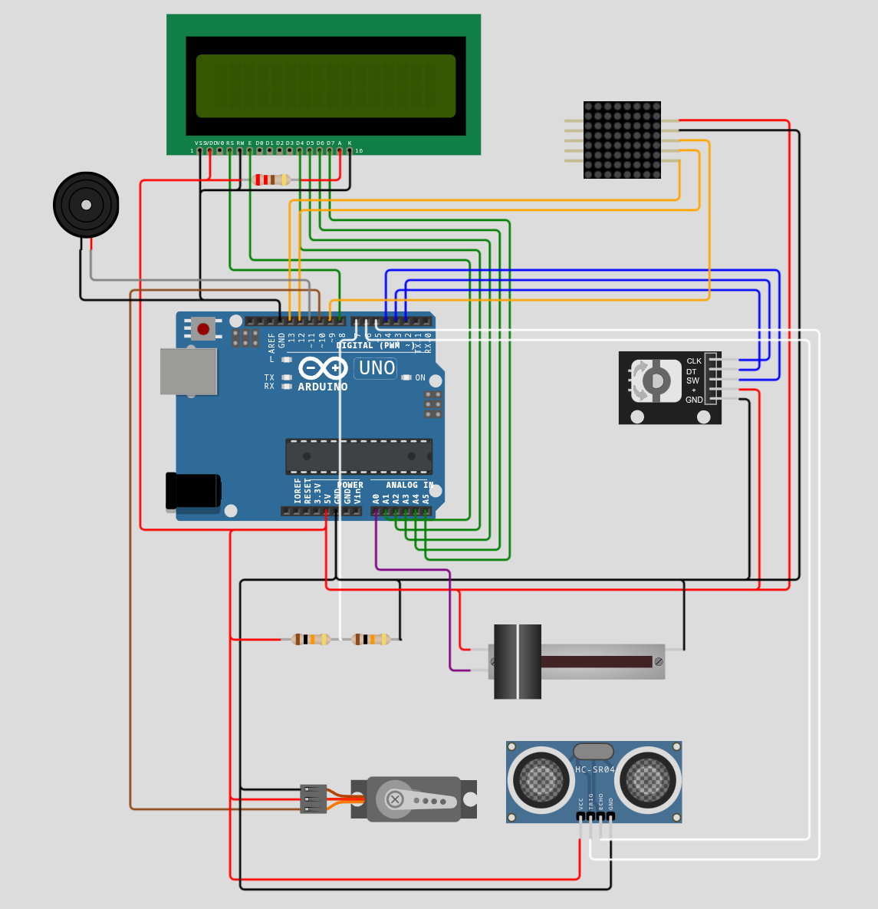
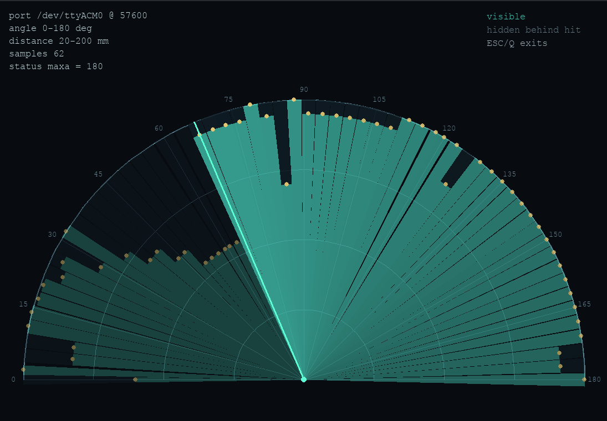

# Ultrasonic Radar

An ATmega328P/Arduino Uno ultrasonic scanning system with an onboard LCD menu,
8x8 matrix radar preview, alarm mode, and an optional high-resolution desktop
visualizer over USART.

The project is intentionally built close to the hardware. The board target is
an Arduino Uno, but the firmware does not use Arduino libraries for the
application logic, peripherals, UI, display, timing, serial output, servo
control, ADC sampling, or sensor capture. The implementation is written against
AVR registers and small local abstractions. PlatformIO is used as the build and
upload environment, but the hardware behavior is implemented directly with
`avr/io.h`, `avr/interrupt.h`, and project code.

## Media





## Purpose

The goal was to build a compact scanning distance sensor that behaves like a
simple radar display at a user-interface level:

- A servo sweeps an ultrasonic range sensor across a configured angular range.
- The firmware samples distance at multiple stopping points across that sweep.
- The onboard matrix display shows a low-resolution occupancy preview.
- A 16x2 LCD menu allows calibration and mode control.
- A Python/Pygame desktop tool can receive the scan stream over serial and
  render a higher-quality visualization.
- An audio sensor can trigger an alarm mode.

This is not radar in the physical sense. A real radar system uses
electromagnetic waves and can have very different propagation, reflection, and
processing behavior. This project uses an ultrasonic time-of-flight sensor.
When the ultrasonic sensor detects the first object along a direction, anything
behind that object is unknown, not measured. The desktop visualizer represents
that by drawing the visible area up to the detected distance and a darker
occluded region from the hit distance out to the configured maximum range.

## Building

The project uses PlatformIO for build/upload workflow:

```sh
pio run
```

Upload with the normal PlatformIO upload command for the configured Uno
environment:

```sh
pio run -t upload
```

Although the PlatformIO environment names the Arduino framework for the Uno
target, the project code itself directly configures AVR hardware registers and
does not rely on Arduino peripheral libraries.

## Limitations

This project prioritizes a working embedded demonstration over a fully general
or hardened framework.

- The ultrasonic sensor reports the first strong obstacle along its direction.
  It does not tell the firmware what exists behind that obstacle.
- Ultrasonic readings can be affected by material, angle of incidence, narrow
  objects, soft surfaces, specular reflection, and environmental noise.
- Servo motion is slow compared with electronic scanning systems, so the scan
  is not instantaneous.
- The onboard 8x8 display is intentionally low resolution.
- The UI/widget API assumes valid widget lifetimes and cooperative use. It is
  not designed as a bulletproof general-purpose GUI library.
- SRAM is tight on the ATmega328P. Large buffers, long strings, and additional
  screens need to be added carefully.
- The serial protocol is simple text for ease of debugging, not a robust binary
  protocol with checksums, framing recovery, or version negotiation.
- The firmware is built for this specific hardware arrangement and pin mapping.
- The project is designed to align with Introduction of Embedded Systems (48434
  IES) Assignment 3 project requirements. As such, questionable decisions might
  have been made to ensure the project remains aligned with the marking rubric.
- The current bundled simulator for this project (Wokwi) is not capable of
  fully replicating the entire feature set. For best results, build the system
  physically.

## Design Overview

### Hardware

The system is designed around:

- ATmega328P / Arduino Uno form factor
- Ultrasonic distance sensor
- Servo motor for angular scanning
- 16x2 character LCD
- 8x8 LED dot matrix module
- Rotary encoder with push button
- Sound sensor
- Buzzer
- External power distribution board or supply

The servo and displays can draw more current than the Arduino board can safely
provide from its onboard regulator or USB supply. In practice, the servo is the
most important load to power externally. Without an external power board or
separate regulated supply, servo movement can cause voltage dips and brownouts,
which look like random MCU resets or boot loops.

Use a shared ground between the external supply and the Arduino.

### Architecture

The code is layered from hardware access up to application behavior.

At the bottom are hardware interface classes such as `OutputPin`, `InputPin`,
`AdcPin`, and pin descriptors. These wrap DDR/PORT/PIN register access without
pulling in Arduino GPIO functions.

Driver-level modules build reusable device behavior:

- `Timer` provides `millis()`, `micros()`, and blocking delay helpers.
- `USART` provides interrupt-driven transmit buffering and receive callbacks.
- `LCDDisplay` provides a double-buffered 16x2 framebuffer.
- `MatrixDisplay` provides a double-buffered 8x8 framebuffer with orientation
  transforms.
- `Adc` configures ADC conversion.

Hardware modules then implement specific devices:

- `Servo` drives OC1B using Timer1 PWM.
- `Ultrasonic` triggers the distance sensor and measures echo timing using
  Timer1 input capture through the analog comparator.
- `Matrix` writes MAX7219-style matrix registers by bit-banging DIN/CLK/CS.
- `LCD` drives the character LCD in 4-bit mode.
- `Dial` decodes the rotary encoder with external interrupts.
- `Buzzer` generates tone output through Timer2.
- `Sound` periodically samples the sound sensor and detects amplitude spikes.

Application modules unify those devices:

- `RadarController` owns scan point generation and the scanning state machine.
- `RadarDisplay` maps scan samples onto the 8x8 matrix.
- `UIManager`, `Screen`, and widgets provide a composable LCD UI framework.
- `CalibrationScreen`, `MenuScreen`, `AlarmScreen`, and `LoadingScreen`
  implement the user workflow.

### User Interface Model

The LCD UI uses a small widget protocol:

- A `Screen` owns an ordered list of `Widget*`.
- Each widget reports its virtual height.
- The screen maps encoder movement to a cursor line and scroll offset.
- Click events are forwarded to the widget under the cursor.
- Selectable widgets can capture events until they release focus.
- Widgets receive a `Navigator*` so they can open popups or change screens.

This keeps the menu code composable while still being small enough for the SRAM
limits of the ATmega328P. The API is pragmatic rather than bulletproof. It was
written under time pressure for a working deadline deliverable, so it assumes
cooperative widget usage and avoids the extra defensive machinery a general UI
library would need.

Popups are transient screens registered through the navigator. They are used
for help text and USART debugging controls.

### Matrix Display Model

The 8x8 matrix is treated as a tiny framebuffer:

- `MatrixDisplay::setPixel()` edits a back buffer.
- `MatrixDisplay::render()` transforms orientation and diffs against the front
  buffer.
- Only changed rows are written to the physical matrix.

The radar display stores per-column obstacle information. For each detected
point, it maps distance into a row and fills the blocked region outward from the
detected obstacle. While calibration is incomplete, the matrix also shows a
small origin marker.

### Serial Rendering Protocol

The desktop visualizer is optional. When a host sends any byte over USART, the
firmware switches into USART rendering mode. The Python visualizer sends `y`
after opening the port to trigger this mode.

Configuration lines start with `$`:

```text
$mind:20
$maxd:200
$mina:0
$maxa:180
```

These mean:

- `mind`: minimum display distance in millimeters
- `maxd`: maximum display distance in millimeters
- `mina`: minimum scan angle in degrees
- `maxa`: maximum scan angle in degrees

Scan samples are streamed as:

```text
$A90,D120,I24
```

Where:

- `A`: scan angle in degrees
- `D`: measured distance in millimeters
- `I`: scan point index

The desktop tool also accepts the same sample without the leading `$`:

```text
A90,D120,I24
```

Whenever configuration is received, the desktop renderer clears existing scan
data because it implies either a restart or an updated calibration.

### Desktop Visualizer

The higher-resolution renderer lives in `tools/`.

Install dependencies:

```sh
python -m pip install -r tools/requirements.txt
```

List serial ports:

```sh
python tools/radar_visualizer.py --list-ports
```

Run:

```sh
python tools/radar_visualizer.py /dev/ttyACM0
```

The default baud rate is `57600`.

The visualizer draws light regions where the sensor has line-of-sight, a bright
hit point at the measured object distance, and a darker region behind the hit
to represent unknown/occluded space.

## Technical Notes

### Timer0

Timer0 is used as the firmware timebase.

- Mode: CTC
- Prescaler: 64
- Compare: `OCR0A = 249`
- Interrupt: `TIMER0_COMPA_vect`
- Result: 1 ms tick for `millis()`

`micros()` combines the millisecond counter with `TCNT0`, giving 4 us timer
granularity at 16 MHz with a 64 prescaler.

### Timer1

Timer1 is shared by servo PWM and ultrasonic echo timing.

Servo output:

- Output: OC1B
- Mode: Fast PWM with `OCR1A` as TOP
- Prescaler: 8
- Tick: 0.5 us
- TOP: `OCR1A = 40000`, giving a 20 ms servo frame
- Pulse: `OCR1B`, mapped from 500 us to 2500 us

Ultrasonic capture:

- Uses the analog comparator input capture path (`ACIC`)
- Uses `TIMER1_CAPT_vect`
- Captures rising edge first, then falling edge
- Echo pulse width is converted into distance

Because Timer1 is shared, the ultrasonic implementation only changes the input
capture flags it needs and leaves the servo PWM configuration intact.

### Timer2

Timer2 is used for the buzzer.

- Mode: CTC
- Output: OC2A toggle
- Prescaler: 64
- Compare: `OCR2A`, computed from the requested tone frequency

Stopping the buzzer disables OC2A toggling and stops the Timer2 clock.

### Interrupts

Interrupts are used for:

- Timer0 compare match timekeeping
- Timer1 input capture for ultrasonic echo timing
- USART RX receive notification
- USART data-register-empty transmit buffering
- INT0/INT1 rotary encoder quadrature decoding

The main loop stays cooperative. It polls high-level events, updates UI state,
updates sensors/controllers, and renders display buffers. Time-critical edges
and byte movement are handled by interrupts.

### ADC

The ADC uses AVcc as reference with a 128 prescaler. The sound sensor is sampled
periodically, and a peak-to-peak amplitude is computed over a short window. If
that amplitude exceeds the configured threshold, alarm mode can be triggered.
